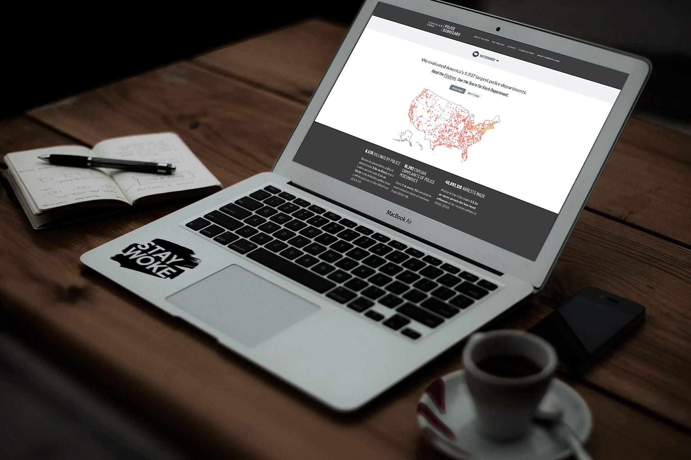

Police Scorecard
===

   

  

Developer Overview
---

1. [Downloading Website](docs/downloading-website.md)
2. [Getting Setup with Docker ( Recommended )](docs/getting-setup-with-docker.md)
3. [Development Scripts](docs/development-scripts.md)
4. [Unit Testing and Code Coverage Reports](docs/unit-testing-and-code-coverage-reports.md)

#### Additional Setup without Docker

* [Getting Setup without Docker](docs/getting-setup-without-docker.md)

#### Additional Information

* [Development Process](docs/development-process.md)
* [Remote Device Testing](docs/device-testing.md)
* [Laravel Docs](https://laravel.com/docs/7.x)
* [Troubleshooting](docs/troubleshooting.md)
