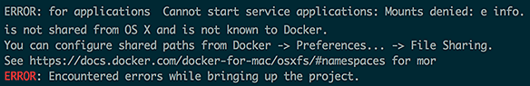
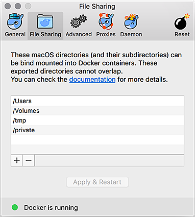

**[↤ Developer Overview](../README.md)**

Troubleshooting
===

Docker Errors
---

### `ERROR: for applications Cannot start service applications: Mounts denied: e info.`

If you see an error that looks like this:

It is because the root directory ( in the example above `/Projects` ) is not listed in Docker's __File Sharing__ tab.  To add your root directory, simply open up Dockers Preferences, select __File Sharing__ and add the root folder to the list.  Then you can rerun your Docker command without issue.

### `ERROR: Couldn't connect to Docker daemon. You might need to start Docker.`

If you see this error, Docker is not running.

PHP Errors
---

### `PHPUnit and no code coverage driver available`

To run Code Coverage Reports you will need to have Xdebug installed. You can check if you have Xdebug installed via `php -i | grep xdebug`

If you are developing on OSX and you do not have Xdebug installed, you can install it via Homebrew `brew install php70-xdebug`.
